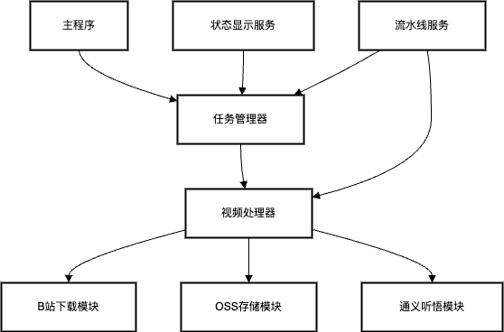
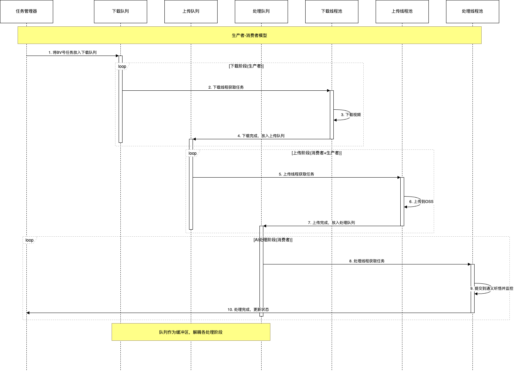
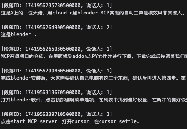
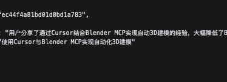
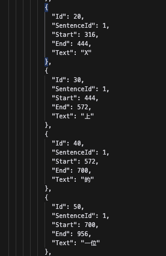
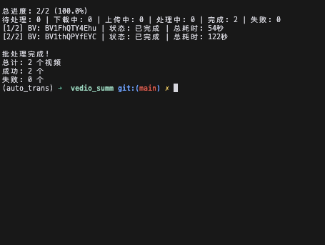

# B站视频摘要工具

<div align="center">
  
</div>

## 项目简介

B站视频摘要工具是一个集视频下载、转写、摘要生成于一体的Python应用程序。通过输入B站视频的BV号，该工具可以自动下载视频，上传到阿里云OSS，利用通义听悟API进行语音识别、文本转写、摘要生成等一系列处理，最终生成详细的视频摘要、字幕文件和智能章节划分。

<div align="center">
  
</div>

## 功能特点

- 🚀 **批量处理**：支持单个视频或批量处理多个B站视频
- 🔄 **流水线处理**：采用流水线模式提高批量处理效率
- 📊 **实时状态**：提供实时处理状态显示和进度跟踪
- 📝 **智能摘要**：利用通义听悟AI生成视频摘要和关键点
- 🔖 **自动章节**：智能生成视频章节划分
- 👥 **角色分离**：支持多人对话的角色分离
- 📄 **多种输出**：支持JSON、纯文本、段落格式的输出
- 🔒 **安全配置**：环境变量和配置文件分离，保护敏感信息

<div align="center">
  
  <p><i>系统采用生产者-消费者模型实现高效并发处理</i></p>
</div>

## 输出展示

<div align="center">
  <div style="display: flex; justify-content: space-between; margin-bottom: 20px;">
    
    
  </div>
  <div style="display: flex; justify-content: space-between;">
    
    
  </div>
  <p><i>输出示例：转写文本、视频摘要、SRT字幕和结果概览</i></p>
</div>

## 安装

### 前提条件

- Python 3.8+
- 阿里云OSS账号和AccessKey
- 通义听悟账号和AppKey
- B站Cookie（用于下载高清视频）

### 安装步骤

1. **克隆仓库**

```bash
git clone https://github.com/yourusername/vedio_summ.git
cd vedio_summ
```

2. **创建并激活虚拟环境**

```bash
python -m venv venv
source venv/bin/activate  # Linux/Mac
venv\Scripts\activate     # Windows
```

3. **安装依赖**

```bash
pip install -r requirements.txt
```

## 配置

1. **创建环境变量文件**

复制`.env.example`文件为`.env`并填写相关信息：

```bash
cp .env.example .env
```

然后编辑`.env`文件，填入以下信息：

```
# B站Cookie
BILIBILI_COOKIE=你的B站cookie

# 阿里云访问密钥
ALIBABA_CLOUD_ACCESS_KEY_ID=你的阿里云AccessKey ID
ALIBABA_CLOUD_ACCESS_KEY_SECRET=你的阿里云AccessKey Secret

# 阿里云OSS配置
OSS_ENDPOINT=oss-cn-beijing.aliyuncs.com
OSS_BUCKET_NAME=你的Bucket名称
OSS_REGION=cn-beijing

# 通义听悟配置
TINGWU_APP_KEY=你的通义听悟AppKey
TINGWU_REGION_ID=cn-beijing
```

2. **配置文件说明**

`config/config.yaml`文件定义了默认配置，一般无需修改。如需自定义，可以修改此文件或在命令行中指定参数。

## 使用方法

### 基本用法

处理单个B站视频：

```bash
python video_summary_demo.py --bvid BV1Gj411w7PZ
```

处理多个视频（从文件读取）：

```bash
python video_summary_demo.py --bvid-file bvid_list.txt
```

### 高级选项

```bash
# 自定义输出目录
python video_summary_demo.py --bvid BV1Gj411w7PZ --output-dir my_outputs

# 保留下载的视频文件
python video_summary_demo.py --bvid BV1Gj411w7PZ --keep

# 设置视频质量（1-120，数值越大质量越高）
python video_summary_demo.py --bvid BV1Gj411w7PZ --quality 80

# 多任务并行处理
python video_summary_demo.py --bvid-file bvid_list.txt --max-concurrent 3
```

### 完整参数说明

```
必选参数（二选一）:
  --bvid BVID             单个视频BV号
  --bvid-file BVID_FILE   包含BV号列表的文件路径，每行一个BV号

可选参数:
  -c, --config CONFIG     配置文件路径
  -o, --output OUTPUT     输出文件路径模板，默认video_{bvid}.mp4
  -q, --quality QUALITY   视频质量，默认80
  --cookie COOKIE         B站Cookie
  --keep                  保留本地文件
  --language-type TYPE    语言类型，默认auto
  --interval INTERVAL     查询间隔(秒)，默认5.0
  --output-dir DIR        输出目录，默认output
  --enable-diarization    启用角色分离，默认开启
  --speaker-count COUNT   说话人数量，默认2
  --enable-chapters       启用章节速览，默认开启
  --enable-meeting        启用智能纪要，默认开启
  --enable-ppt            启用PPT提取，默认关闭
  --enable-polish         启用口语书面化，默认开启
  --max-concurrent N      最大并发上传任务数，默认1
  --pipeline              启用流水线处理模式，默认开启
  --no-status-display     禁用状态显示
```

## 项目结构

```
vedio_summ/
├── config/                  # 配置文件目录
│   └── config.yaml          # 主配置文件
├── src/                     # 源代码
│   └── bilibili_downloader/ # B站下载器模块
│       ├── core/            # 核心功能模块
│       ├── services/        # 服务模块
│       └── exceptions/      # 异常处理
├── images/                  # 项目图片展示
├── .env.example             # 环境变量示例文件
├── .gitignore               # Git忽略文件
├── requirements.txt         # 项目依赖
├── video_summary_demo.py    # 主入口脚本
└── README.md                # 项目说明文档
```

## 技术原理

系统采用生产者-消费者模式，通过队列和线程池实现并行处理：

1. **下载阶段(生产者)**：从B站API获取视频信息和下载链接，将视频下载到本地
2. **上传阶段(中间消费者+生产者)**：将本地视频上传至OSS并生成临时URL
3. **AI处理阶段(消费者)**：将URL提交给通义听悟API进行处理，并监控处理进度

这种架构允许系统在网络I/O等待期间并行处理多个任务，大大提高了批量处理效率。通过任务管理器实时监控各任务状态，提供直观的进度显示。

## 注意事项

1. **密钥安全**：请勿将包含真实密钥的`.env`文件提交到版本控制系统
2. **网络要求**：确保网络稳定，视频下载和API调用需要良好的网络环境
3. **存储空间**：处理大视频需要足够的磁盘空间
4. **OSS费用**：使用阿里云OSS存储和通义听悟API可能产生费用，请关注账单
5. **B站限制**：频繁下载视频可能触发B站的限制，建议适度使用

## 定制开发服务

基于这个开源项目，我们提供以下定制开发服务：

1. **企业级部署**：为企业内部搭建私有化视频处理系统
2. **功能定制**：根据特定需求开发专属功能
3. **平台集成**：与现有系统无缝对接
4. **培训与支持**：提供技术培训和长期技术支持

## 贡献指南

欢迎提交问题报告和功能建议。如果您想贡献代码，请先Fork本仓库，然后提交Pull Request。

## 许可证

本项目采用MIT许可证。详见LICENSE文件。

## 联系方式

- Email: yourname@example.com
- GitHub: github.com/yourusername/vedio_summ
- 微信: your_wechat_id

## 致谢

- 感谢阿里云OSS提供存储服务
- 感谢通义听悟提供AI转写和摘要能力
- 感谢B站提供丰富的视频内容

---

*注: 请合法使用此工具，遵守B站用户协议和相关法律法规。不得用于侵权或商业用途。*
